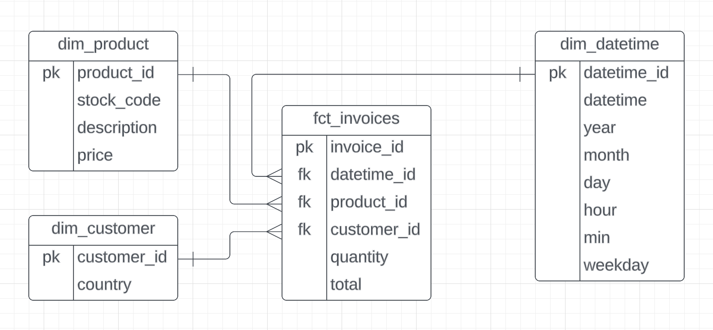

# de-retail-2-elt
A complete data engineering project with ELT pipeline for online Retail Sales

ELT(Extract, Load, and Transform) loads raw data directly into the target data warehouse with no or minimal transformation. Data is then transformed within the data warehouse when needed. With reduction in cloud services costs over the years, ELT is often used in conjunction with modern data warehouses and big data platforms that support distributed processing and analytics

Overall, a data engineering/analysis project for retail data empowers business to extract actionable insights, drive innovation, and stay competitive in today's dynamic retail landscape. By harnessing the power of data, retailers can unlock new opportunities for growth, efficiency, and customer satisfaction. Streamlining data pipelines and automating data workflows significantly enhances operational efficiency within retail organization. By reducing manual effort, eliminating data silos, and ensuring data consistency and integrity, business can save time and resources while improving overall productivity.

The framework used in this project can be easily adapted to any other retail/Wholesale dataset.

## Dataset

https://www.kaggle.com/datasets/tunguz/online-retail

| Column        |    Description                                                                                        |
| --------------|-------------------------------------------------------------------------------------------------------|
| InvoiceNo:    |    Invoice number. Nominal, a 6-digit integral number uniquely assigned to each transaction. If this code starts with letter 'c', it indicates a cancellation.                                                                                            |
| StockCode:    |    Product (item) code. Nominal, a 5-digit integral number uniquely assigned to each distinct product.|
| Description:  |    Product (item) name. Nominal.                                                                      |
| Quantity:     |    The quantities of each product (item) per transaction. Numeric.                                    |
| InvoiceDate:  |    Invice Date and time. Numeric, the day and time when each transaction was generated.               |   
| UnitPrice:    |    Unit price. Numeric, Product price per unit in sterling.                                           |
| CustomerID:   |    Customer number. Nominal, a 5-digit integral number uniquely assigned to each customer.            |
| Country:      |    Country name. Nominal, the name of the country where each customer resides.                        |

## Prerequisites

- GitHub codespace (includes docker)
    - Astro CLI
- Soda account
- GCP account

Note: A free version of above should suffice for this project

## Tech stack

- GitHub codespace
    - Astro CLI - Data orchestration with Apache Airflow
    - Astro cosmos - Integrated dbt + Airflow
    - soda - Data quality tests in data pipelines
    - metabse - Data visualization
- GCP storage bucket - Data lake
- GCP Bigquery - OLAP Data warehouse

## Pipeline architecture

## Data modeling

## Steps

- Download the dataset https://www.kaggle.com/datasets/tunguz/online-retail
    - Store the csv file in `include/dataset/online_retail_raw.csv`
- Create a GCS bucket with a unique name `<your_name>_online_retail`
- Create a service account with a name `airflow-online-retail`
    - Grant admin access to GCS + BigQuery
    - Click on the service account → Keys → Add Key → Copy the JSON content
    - Create a new file `service_account.json` in `include/gcp/` and paste keyfile contents into it
    
        Note: Make sure to add `include/gcp/` to .gitignore

- Follow the steps/commands from `include/extras/commands` file to test individual tasks in DAG
- In the browser, go to Airflow (http://localhost:8080/) and click Run button for `retail` DAG. Ensure that all tasks in DAG are successfully completed.
- Verify in GCS bucket and Bigquery that all files are created by DAG as expected
- In the browser, go to Metabase (http://localhost:3000/) and create visualizations/dashboard by connecting to BigQuery DWH: `retail` tables

## Pipeline

- Airflow DAG

- BigQuery DWH - Retail

- soda data quality checks

- Metabase Dashboard

