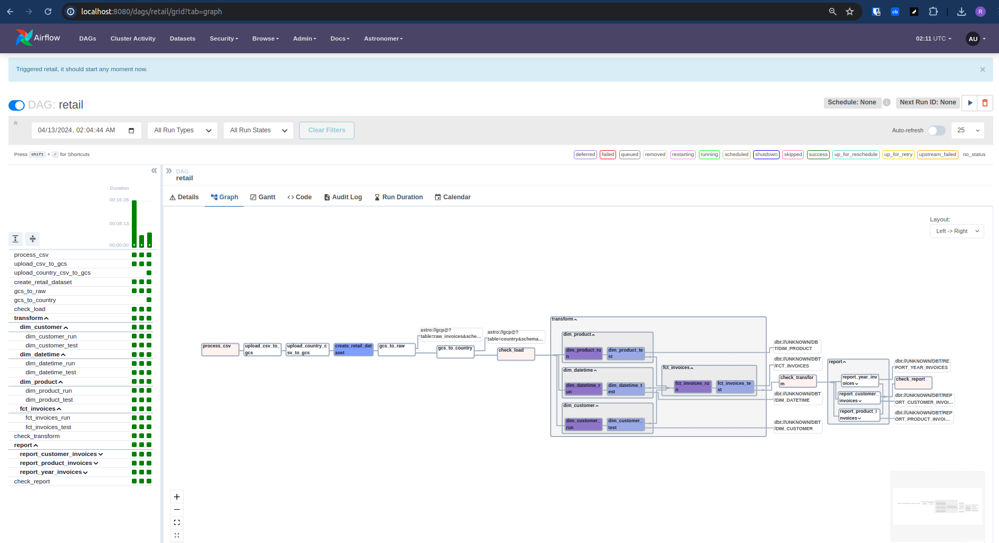

# de-retail-2-elt
A complete data engineering project with ELT pipeline for online Retail Sales

## Dataset

https://www.kaggle.com/datasets/tunguz/online-retail

| Column        |    Description                                                                                        |
| --------------|-------------------------------------------------------------------------------------------------------|
| InvoiceNo:    |    Invoice number. Nominal, a 6-digit integral number uniquely assigned to each transaction. If this code starts with letter 'c', it indicates a cancellation.                                                                                            |
| StockCode:    |    Product (item) code. Nominal, a 5-digit integral number uniquely assigned to each distinct product.|
| Description:  |    Product (item) name. Nominal.                                                                      |
| Quantity:     |    The quantities of each product (item) per transaction. Numeric.                                    |
| InvoiceDate:  |    Invice Date and time. Numeric, the day and time when each transaction was generated.               |   
| UnitPrice:    |    Unit price. Numeric, Product price per unit in sterling.                                           |
| CustomerID:   |    Customer number. Nominal, a 5-digit integral number uniquely assigned to each customer.            |
| Country:      |    Country name. Nominal, the name of the country where each customer resides.                        |

## Prerequisites

- GitHub codespace (includes docker)
    - Astro CLI
- Soda account
- GCP account

Note: A free version of above should suffice for this project

## Tech stack

- GitHub codespace
    - Astro CLI - Data orchestration with Apache Airflow
    - Astro cosmos - Integrated dbt + Airflow
    - soda - Data quality tests in data pipelines
    - metabse - Data visualization
- GCP storage bucket - Data lake
- GCP Bigquery - OLAP Data warehouse

## Pipeline

- Airflow DAG

- BigQuery DWH - Retail

- soda data quality checks

- Metabase Dashboard

